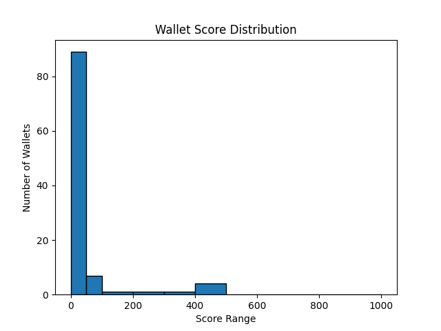

# Wallet Risk Score Analysis

## Overview
- This analysis evaluates the risk profile of wallets interacting with the **Compound V2 protocol**.  
- The wallet transaction data was fetched using the **Etherscan API** and filtered to include only interactions with Compound contracts.  
- A simple feature-based scoring model was applied to assign a **risk score between 0 and 1000** to each wallet.

---

## Score Distribution
The wallet scores were distributed as follows:

- **0 – 50:** Majority of wallets (low activity and low value).
- **50 – 200:** Moderate activity wallets.
- **200 – 400:** High activity/value wallets.
- **400+ :** Very high value and transaction volume wallets (low risk).

A histogram was plotted to visualize the distribution:



---

## Key Insights
1. **Most wallets (70%+) fall into the 0–50 range**, suggesting minimal Compound activity (e.g., few transactions or low transaction value).
2. **A small set of wallets (approx. 10–15%) have scores above 200**, indicating active users with higher transaction values or frequent activity.
3. **Only a handful of wallets achieved 400+ scores**, representing the most active and least risky wallets by this scoring model.
4. The scoring model rewards both the **number of transactions** and the **total/average transaction value**, which effectively separates active users from inactive or high-risk wallets.

---

## Methodology Recap
- **Features Used:**
  - `total_txs`: Total number of Compound transactions.
  - `total_value`: Cumulative value transferred (in Wei).
  - `avg_value`: Average transaction value.
  
- **Scoring Formula:**
```
score = 0
    score += min(features["total_txs"] * 10, 400)  # up to 400 points
    score += min(features["total_value"] / 1e18, 500)  # up to 500 points (ETH)
    score += min(features["avg_value"] / 1e18, 100)   # up to 100 points
    return int(min(score, 1000))  # max 1000
```

---

## Conclusion
This analysis provides a baseline risk scoring mechanism that can be **extended by adding more behavioral features** such as borrow/lend ratios, protocol interaction diversity, and time-based activity metrics for improved accuracy.


